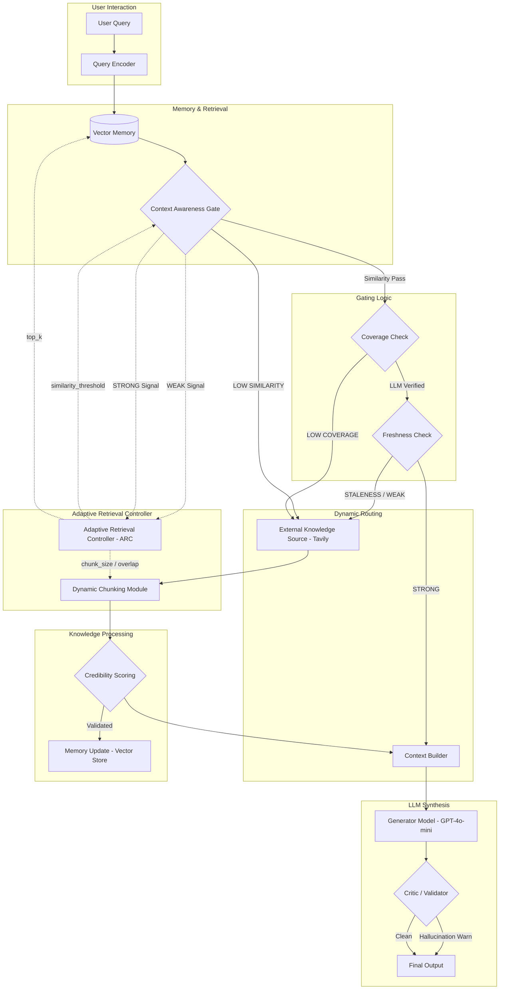

# ACARA Project Architecture & Flow

This document details the **Adaptive Context-Aware Retrieval Architecture (ACARA)** flow.

## 🛠 System Flow Diagram

## 🧩 Core Components

### 1. ARC (Adaptive Retrieval Controller)
The "brain" of the architecture. It dynamically adjusts retrieval parameters (threshold, top_k, chunking) based on pipeline feedback signals.

### 2. Context Awareness Gate
A multi-dimensional filter that evaluates retrieved chunks for:
- **Similarity**: Vector distance against dynamic ARC threshold.
- **Coverage**: Semantic relevance determined by structured LLM grading.
- **Freshness**: Date-based filtering to avoid stale information.

### 3. Dynamic Chunking Module
Adjusts chunk size and overlap based on query complexity, ensuring optimal retrieval for both short and long queries.

### 4. Credibility Scoring
Validates external knowledge before it is used for generation or stored in long-term memory.

### 5. Critic / Validator
A final verification stage that flags hallucinations or unsupported claims before the user sees the output.
